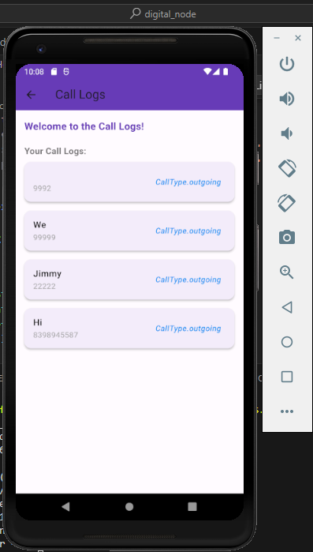

# digital_node

Call Logs

## Getting Started

Clone the repository: 
git clone https://github.com/Himanshusharma83/Digital_CallLogs.git
Navigate to the project folder:
cd digital_node
Run the app: flutter run

For help getting started with Flutter development, view the
[online documentation](https://docs.flutter.dev/), which offers tutorials,
samples, guidance on mobile development, and a full API reference.

LoginPage Widget Explanation:
The LoginPage widget is responsible for displaying the login interface. It includes input fields for email and password, a login button, and a "Forgot Password?" text button.

Text Controllers:

emailController: Manages the input for the email field.
passwordController: Manages the input for the password field.
Widget Tree:

AppBar: Displays the title "Login Page."
Body:
Column: Organizes child widgets vertically in a column.
Amazon Logo: (Commented Out) Placeholder for an Amazon logo image.
TextFields: Input fields for email and password.
ElevatedButton ("Login"): Initiates the login process.
TextButton ("Forgot Password?"): Allows users to recover a forgotten password.
Styling:

TextFields and Buttons: Styled with appropriate border radius and padding for a clean and modern look.
Logic:

Login Function (_login):
Extracts email and password from the input fields.
Checks if the provided credentials match a demo account (demo@example.com / 123456).
If valid, navigates to the HomePage.
If invalid, displays a SnackBar with an "Invalid credentials" message.

HomePage Widget Explanation:
The HomePage widget is responsible for displaying call logs, fetching data from the device's call history. It includes an app bar, a welcome message, and a list of call logs.

State Variables:

callLogs: A list to store call log entries.
prefs: SharedPreferences instance to store the last opened time.
lastOpenedTime: DateTime variable to track the last time the app was opened.
Initialization (initState):

Calls _initSharedPreferences to initialize SharedPreferences.
Calls _checkAndLoadCallLogs to check and request phone permission.
SharedPreferences (_initSharedPreferences):

Initializes SharedPreferences to store the last opened time.
Permission Check (_checkAndLoadCallLogs):

Requests phone permission using the Permission.phone package.
If granted, calls _loadCallLogs to fetch and display call logs.
Load Call Logs (_loadCallLogs):

Fetches call logs using the call_log package.
Filters call logs based on the last opened time.
Updates the UI with the new call logs and saves the current time.
UI Building (build):

Displays a Scaffold with an AppBar and a body.
The body contains a welcome message and a ListView of call logs.
Each call log is represented by a Card with a ListTile.
Color Coding (_getColorForCallType):

A helper method to assign colors based on call types (incoming, outgoing, missed).

