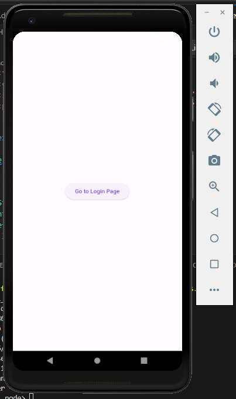
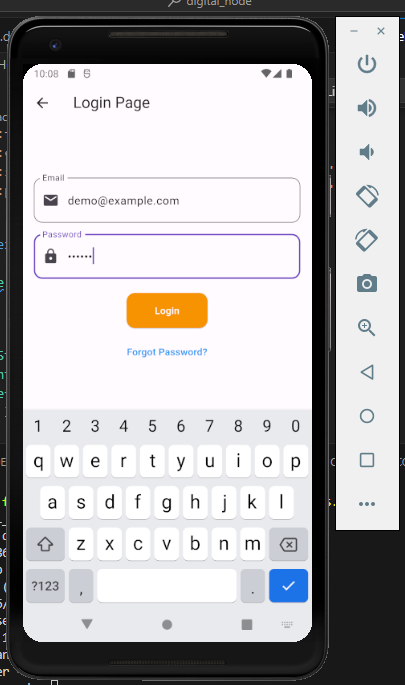

# digital_node

Call Logs

## Getting Started

Clone the repository: git clone https://github.com/Himanshusharma83/Digital_CallLogs.git
Navigate to the project folder:
 cd digital_node
Run the app: flutter run

- [Lab: Write your first Flutter app](https://docs.flutter.dev/get-started/codelab)
- [Cookbook: Useful Flutter samples](https://docs.flutter.dev/cookbook)

For help getting started with Flutter development, view the
[online documentation](https://docs.flutter.dev/), which offers tutorials,
samples, guidance on mobile development, and a full API reference.

LoginPage Widget Explanation:
The LoginPage widget is responsible for displaying the login interface. It includes input fields for email and password, a login button, and a "Forgot Password?" text button.

Text Controllers:

emailController: Manages the input for the email field.
passwordController: Manages the input for the password field.
Widget Tree:

AppBar: Displays the title "Login Page."
Body:
Column: Organizes child widgets vertically in a column.
Amazon Logo: (Commented Out) Placeholder for an Amazon logo image.
TextFields: Input fields for email and password.
ElevatedButton ("Login"): Initiates the login process.
TextButton ("Forgot Password?"): Allows users to recover a forgotten password.
Styling:

TextFields and Buttons: Styled with appropriate border radius and padding for a clean and modern look.
Logic:

Login Function (_login):
Extracts email and password from the input fields.
Checks if the provided credentials match a demo account (demo@example.com / 123456).
If valid, navigates to the HomePage.
If invalid, displays a SnackBar with an "Invalid credentials" message.

